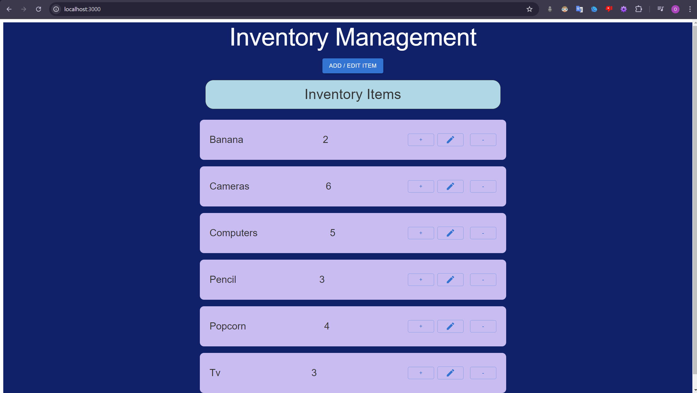
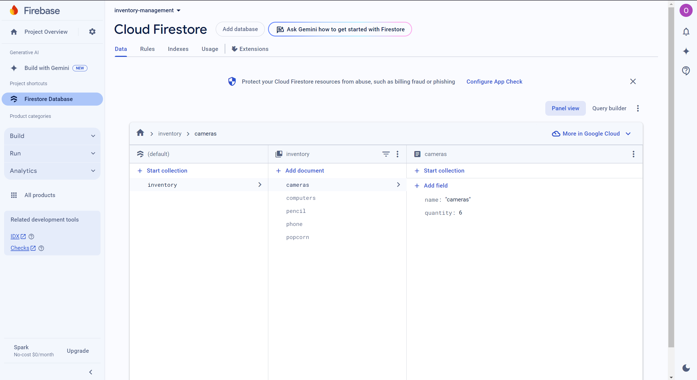
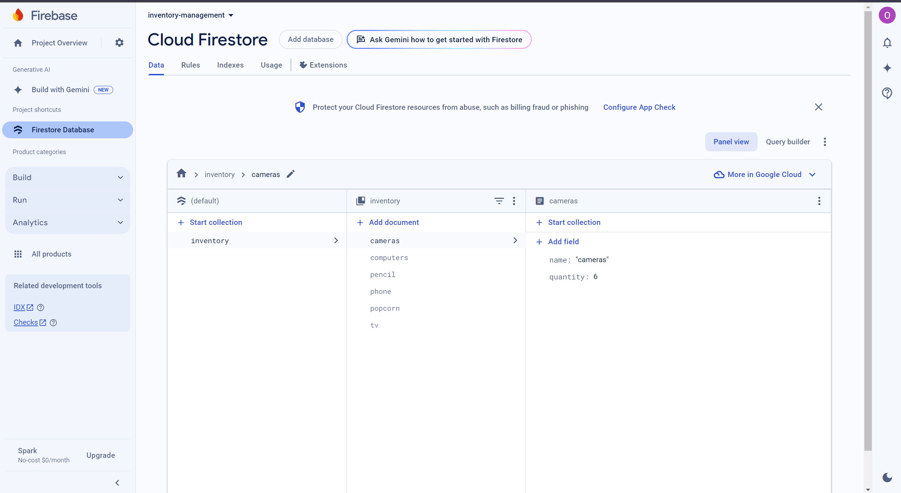

In this project, I created a web app where users can read, write, and delete items into an inventory management system using interactive buttons or the edit feature. 

The tech stack I used was Next.js, React, TypeScript, Material UI, and Firebase!

This is how the UI looks. The quantity of each item is slightly unaligned, but does not detract from the application's purpose.

This is a Modal which enables users to add items, edit items, and delete

This is how my Firebase database looks like
